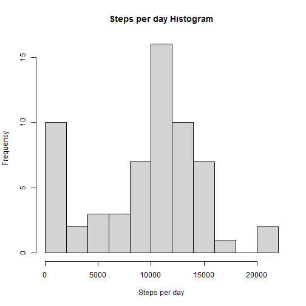
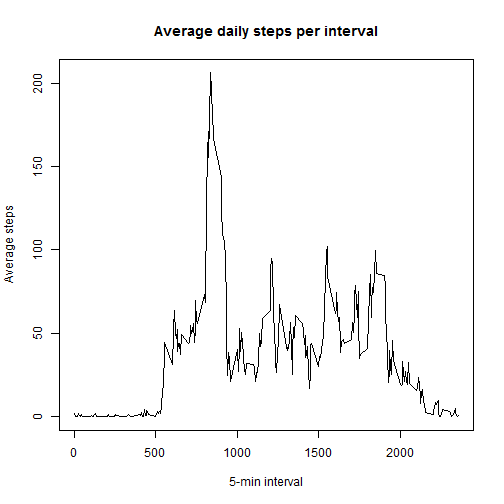
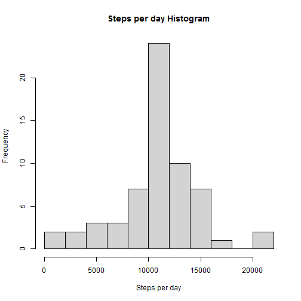
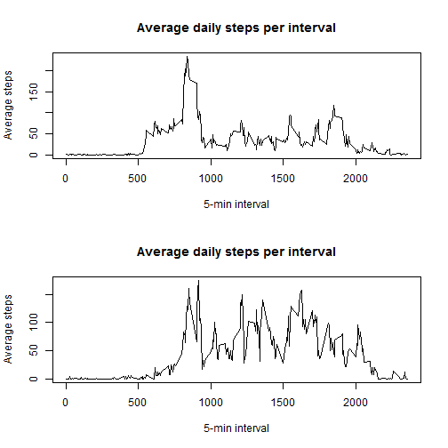

Course Project 1
------------------------------------------

### Loading and preprocessing the data


```
##    steps       date interval
## 1     NA 2012-10-01        0
## 2     NA 2012-10-01        5
## 3     NA 2012-10-01       10
## 4     NA 2012-10-01       15
## 5     NA 2012-10-01       20
## 6     NA 2012-10-01       25
## 7     NA 2012-10-01       30
## 8     NA 2012-10-01       35
## 9     NA 2012-10-01       40
## 10    NA 2012-10-01       45
```


### What is mean total number of steps taken per day?

1. Calculate the total number of steps taken per day


```
## # A tibble: 10 x 2
##    date       total_steps
##    <date>           <int>
##  1 2012-10-01           0
##  2 2012-10-02         126
##  3 2012-10-03       11352
##  4 2012-10-04       12116
##  5 2012-10-05       13294
##  6 2012-10-06       15420
##  7 2012-10-07       11015
##  8 2012-10-08           0
##  9 2012-10-09       12811
## 10 2012-10-10        9900
```

2. Histogram




3. Calculate mean and median


```
## [1] 9354.23
```

```
## [1] 10395
```


### What is the average daily activity pattern?

1. Series plot of the 5-minute interval and the average number of steps taken





2. 5-minutes interval with the maximum number of steps


```
## # A tibble: 1 x 1
##   interval
##      <int>
## 1      835
```


### Imputing missing values

1. Total Nas


```
## [1] 2304
```


2/3.Substitute NA by mean and create the dataset


```
##      steps       date interval
## 1  37.3826 2012-10-01        0
## 2  37.3826 2012-10-01        5
## 3  37.3826 2012-10-01       10
## 4  37.3826 2012-10-01       15
## 5  37.3826 2012-10-01       20
## 6  37.3826 2012-10-01       25
## 7  37.3826 2012-10-01       30
## 8  37.3826 2012-10-01       35
## 9  37.3826 2012-10-01       40
## 10 37.3826 2012-10-01       45
```

4. Make the histogram an calculate mean and median





```
## [1] 10766.19
```

```
## [1] 10766.19
```


### Are there any differences in activity patterns between weekdays and weeends?

1. Create new vector with variables weekday and weekend


```
##    steps       date interval weekday weekend
## 1     NA 2012-10-01        0  Monday   FALSE
## 2     NA 2012-10-01        5  Monday   FALSE
## 3     NA 2012-10-01       10  Monday   FALSE
## 4     NA 2012-10-01       15  Monday   FALSE
## 5     NA 2012-10-01       20  Monday   FALSE
## 6     NA 2012-10-01       25  Monday   FALSE
## 7     NA 2012-10-01       30  Monday   FALSE
## 8     NA 2012-10-01       35  Monday   FALSE
## 9     NA 2012-10-01       40  Monday   FALSE
## 10    NA 2012-10-01       45  Monday   FALSE
```

2. Plot comparing weekdays and weekends


```
## `summarise()` ungrouping output (override with `.groups` argument)
## `summarise()` ungrouping output (override with `.groups` argument)
```




